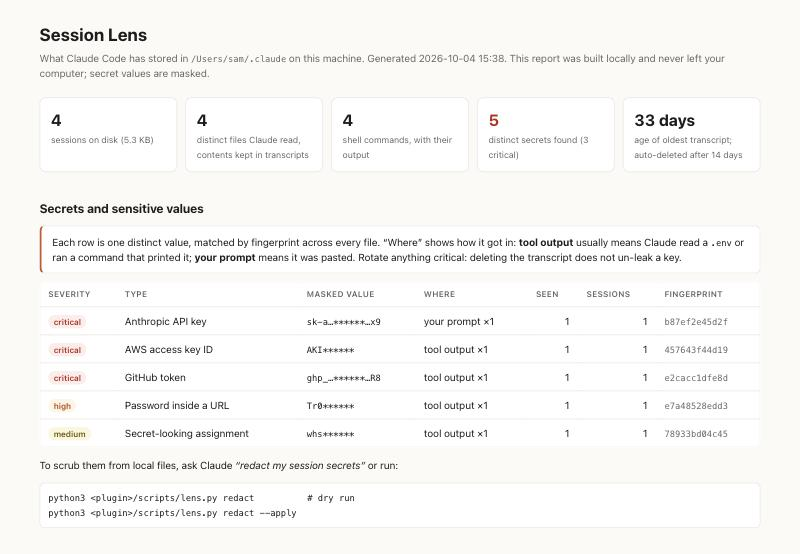

# Session Lens

See what Claude Code keeps about your sessions on your own disk, find secrets that leaked into it, scrub them, and stop new ones getting in.

Free and local: Python 3 standard library, no network calls, no API key, works on any Claude plan.



## Why

Every Claude Code session is saved as plain text under `~/.claude/`:

| Store | What's in it |
|---|---|
| `projects/<project>/<session>.jsonl` | Every prompt, reply, thinking block, tool call **and its full output**: whole files Claude read, command output, fetched pages |
| `history.jsonl` | Every prompt you typed, plus pastes |
| `file-history/` | Copies of files from before Claude edited them |
| `shell-snapshots/` | Your shell functions, aliases and options |

So if Claude ran `cat .env` once, those keys now sit in a transcript until the retention window (`cleanupPeriodDays`, default 30) deletes it, and they get copied by any backup or sync of your home directory.

## Install

```
/plugin marketplace add <your-github-user>/session-lens
/plugin install session-lens@session-lens
```

## Use

Ask Claude *"what's in my session transcripts?"* or *"did any keys leak into my sessions?"*, or run it directly:

```bash
python3 scripts/lens.py scan            # opens ~/.claude/session-lens/report.html
python3 scripts/lens.py redact          # dry run: what would be replaced
python3 scripts/lens.py redact --apply  # replace each secret with [REDACTED:<type>]
```

The report shows:

- **Secrets**: API keys (Anthropic, OpenAI, AWS, GitHub, GitLab, Slack, Stripe, Google, npm, Hugging Face), private keys, JWTs, passwords in URLs, `*_SECRET=` / `*_TOKEN=` assignments, card numbers. Each is masked, fingerprinted, counted across every session, and labelled with how it got in (your prompt, tool output, Claude's reply).
- **Storage inventory**: every local store, its size, and what it holds.
- **Per-session detail**: project, branch, files read and changed, commands run, URLs fetched, MCP servers used.
- **Retention**: your current `cleanupPeriodDays` and the age of your oldest transcript.

See [`examples/sample-report.html`](examples/sample-report.html), generated from synthetic data.

Redaction keeps transcripts valid JSONL so `--resume` still works, rewrites atomically, skips binary files, and skips transcripts touched in the last two minutes (the live session) unless you pass `--include-active`.

**Redacting does not revoke a key.** Anything that appeared in a session was also sent to the model. Rotate it at the provider.

## Guard hook (prevention)

Installed automatically with the plugin:

- **Prompts**: a prompt containing a critical or high-severity secret is blocked before it is saved. Add `#allow-secret` to send it anyway.
- **Tool calls**: Claude Code asks you first before Claude reads `.env`, SSH private keys, `*.pem`, `.npmrc`, `~/.aws/credentials`, kube/docker/gcloud credentials, or runs `printenv`, `gh auth token`, `cat secrets.yml` and similar.

Disable with `SESSION_LENS_GUARD=off`. The guard never fails closed: if it errors, the action goes through.

## Recommended settings

```json
{
  "cleanupPeriodDays": 7,
  "permissions": {
    "deny": ["Read(./.env)", "Read(./.env.*)", "Read(./secrets/**)"]
  }
}
```

## Limits

Pattern matching catches known key formats and obvious assignments. It will miss free-form secrets ("the password is hunter2") and personal data like names or addresses. Treat a clean report as "no known patterns", not "nothing sensitive".
